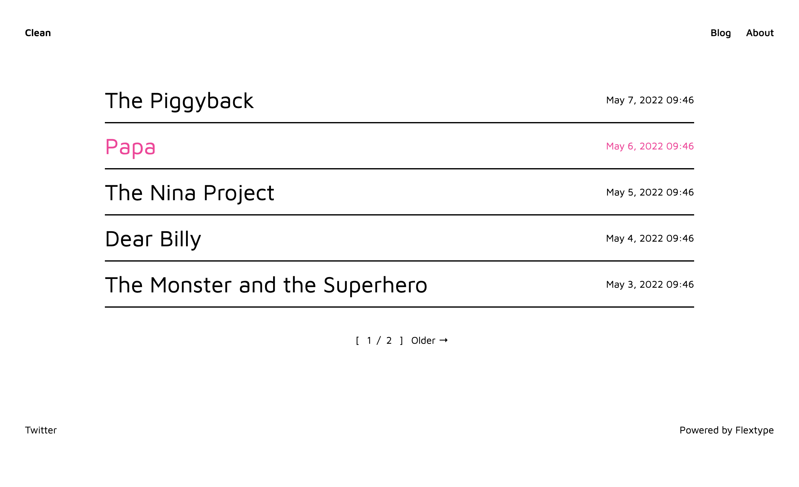

<h1 align="center">Clean Starter Kit for <a href="https://awilum.github.io/flextype">Flextype</a></h1>

   

  

Clean is a minimalist Starter Kit for a blog or personal site.

## Features
* Markdown focused writing experience
* Beautifully responsive
* Built with TailwindCSS

## Dependencies

The following dependencies need to be downloaded and installed for Clean Starter Kit

| Item | Version | Download |
|---|---|---|
| [flextype](https://github.com/flextype/flextype) | ^1.0.0-alpha.1 | [download](https://github.com/flextype/flextype/releases) |

## Installation

1. Download & Install all required dependencies.
2. Create new folder `project`
3. Download Clean Starter Kit and unzip plugin content to the folder `project`

## Recompile the CSS (optional)
1. Go to `project` folder in your console and run `npm install` to install node dependencies.
2. Run `npx tailwindcss -i ./assets/src/css/styles.css -o ./assets/dist/css/styles.css`

## License
[The MIT License (MIT)](https://github.com/flextype-starter-kits/clean/blob/master/LICENSE.txt)
Copyright (c) [Sergey Romanenko](https://github.com/Awilum)
