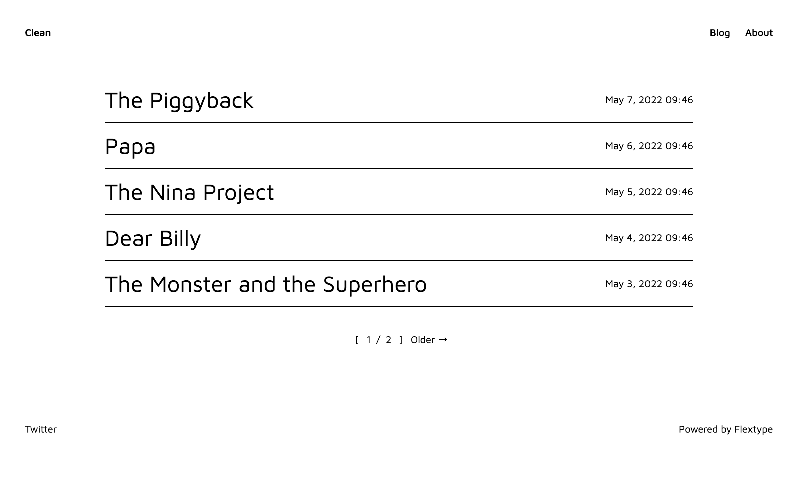

<h1 align="center">Clean Starter Kit for <a href="https://awilum.github.io/flextype">Flextype</a></h1>

 

   

  

Clean is a minimalist Starter Kit for a blog or personal site.

## Features
* Installed and preconfigured site, sitemap and twig plugins.
* Markdown focused writing experience.
* Beautifully responsive.
* Built with TailwindCSS.

## Dependencies

The following dependencies need to be downloaded and installed for Clean Starter Kit

| Item | Version | Download |
|---|---|---|
| [flextype](https://github.com/flextype/flextype) | ^1.0.0-alpha.2 | [download](https://github.com/flextype/flextype/releases) |
| [site](https://github.com/flextype-plugins/site) | ^2.1.0 | [download](https://github.com/flextype-plugins/site/releases) |
| [feed](https://github.com/flextype-plugins/feed) | ^2.1.0 | [download](https://github.com/flextype-plugins/feed/releases) |
| [sitemap](https://github.com/flextype-plugins/sitemap) | ^3.1.0 | [download](https://github.com/flextype-plugins/sitemap/releases) |
| [twig](https://github.com/flextype-plugins/twig) | ^3.2.0 | [download](https://github.com/flextype-plugins/twig/releases) |

## Installation

1. Create new folder `project`.
2. Download [Clean Starter Kit](https://github.com/flextype-starter-kits/clean/releases) and unzip starter kit content to the folder `project`

## Resources
* [Documentation](https://awilum.github.io/flextype/downloads/extend/starter-kits/clean)

## License
[The MIT License (MIT)](https://github.com/flextype-starter-kits/clean/blob/master/LICENSE.txt)
Copyright (c) [Sergey Romanenko](https://github.com/Awilum)
